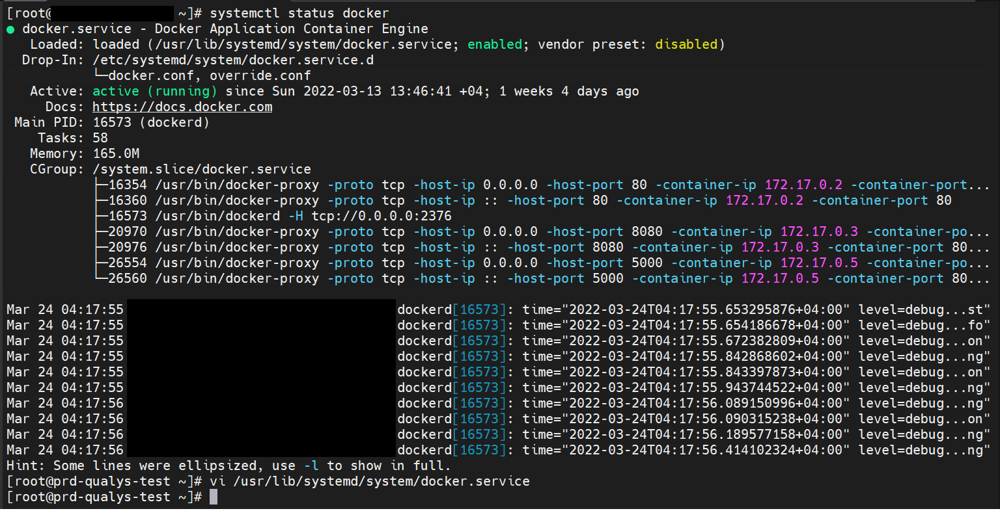

# docker-api-expose-secure
## Scenario
There are cases like a remote execution of docker commands from a local machine to a remote server or a remote monitoring machine say PRTG need to scan the docker enggine for getting the server utilisation/container utilisation per container based can be done via, docker API exposes.

## Environment
We are taking a CentOS 7 based server for exposing it's container enggine's(docker) API to be exposed to outside, securely.

## Pre requisites
A CentOS 7 machine, with docker pre-installed some running containers.
Note: If a new system to be installed you may use following link, 
```
https://docs.docker.com/engine/install/centos/
```

## Steps involving, creating ca, server and client certificates and keys.
### Create Directory under /etc/docker
```
mkdir /etc/docker/ssl/
cd /etc/docker/ssl/
```
Generate Certificates

```
openssl genrsa -out ca-key.pem 2048
openssl req -new -x509 -days 777 -key ca-key.pem -sha256 -out ca.pem
openssl genrsa -out server-key.pem 2048
openssl req -subj "/CN=$HOSTNAME" -new -key server-key.pem -out server.csr
```
Now change the IP to local machine IP(private IP, here it is 172.16.10.65 )
```
echo "subjectAltName = DNS:$HOSTNAME,IP:172.16.10.65,IP:127.0.0.1" > extfile.cnf
openssl x509  -req -days 777 -in server.csr -CA ca.pem -CAkey ca-key.pem -CAcreateserial -out server-cert.pem -extfile extfile.cnf
openssl genrsa -out client-key.pem 2048
openssl req -subj "/CN=$HOSTNAME" -new -key client-key.pem -out client.csr
echo "extendedKeyUsage = clientAuth" > extfile.cnf
openssl x509 -req -days 365 -in client.csr -CA ca.pem -CAkey ca-key.pem -CAcreateserial -out client-cert.pem -extfile extfile.cnf
```
We need to create a new configuration json file as daemon.json under /etc/docker/
```
vi /etc/docker/daemon.json
#add following lines to the configuration file
{
"debug": true,
"tlscacert": "/etc/docker/ssl/ca.pem",
"tlscert": "/etc/docker/ssl/server-cert.pem",
"tlskey": "/etc/docker/ssl/server-key.pem",
"tlsverify": true
}
```
Now we need to edit the original configuration file of docker, 
```
vi /usr/lib/systemd/system/docker.service
```
Under this we need to add following, 
```
[Service]
Type=notify
# the default is not to use systemd for cgroups because the delegate issues still
# exists and systemd currently does not support the cgroup feature set required
# for containers run by docker
ExecStart=/usr/bin/dockerd -H fd:// --containerd=/run/containerd/containerd.sock
ExecReload=/bin/kill -s HUP $MAINPID
TimeoutSec=0
RestartSec=2
Restart=always
```
To
```
[Service]
Type=notify
# the default is not to use systemd for cgroups because the delegate issues still
# exists and systemd currently does not support the cgroup feature set required
# for containers run by docker
ExecStart=/usr/bin/dockerd -H fd:// --containerd=/run/containerd/containerd.sock -H tcp://0.0.0.0:2376
ExecReload=/bin/kill -s HUP $MAINPID
TimeoutSec=0
RestartSec=2
Restart=always
```
In firewalld you have to permitt the port to expose.
```
#If firewall runs
firewall-cmd --permanent --add-port=2376/tcp
firewall-cmd --reload
```
We need to reload configuration and restart docker daemon.
```
systemctl daemon-reload
systemctl restart docker
```
After this a status will show the port been exposed.
```
systemctl status docker
```

<center> </img></center>

By combining the client-cert.pem and ca.pem in the client machine/prtg monitor we will have the client certificate and the key will be client-key.pem. 
in the client machine at the home directory you have to create .docker named directory. Under this you can keep ca.pem(combined client-cert.pem + ca.pem) and the above mentioned key.

now fromt the client machine you can use the command, 
```
docker -H tcp://172.16.10.65:2376 ps   #will display the docker ps command in that system
```

## Conclusion
This simple settings will help us to enable a secure remote execution of commands without worrying an open exposed remote API port of the host. Security served.
